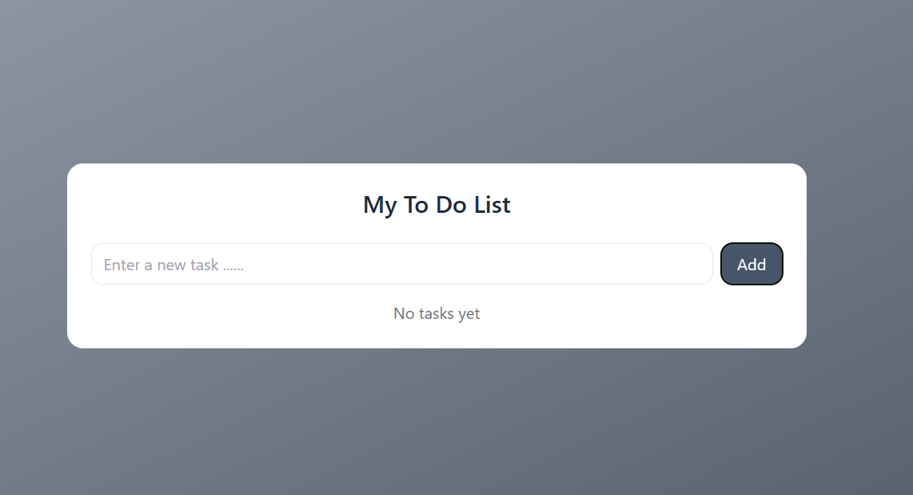
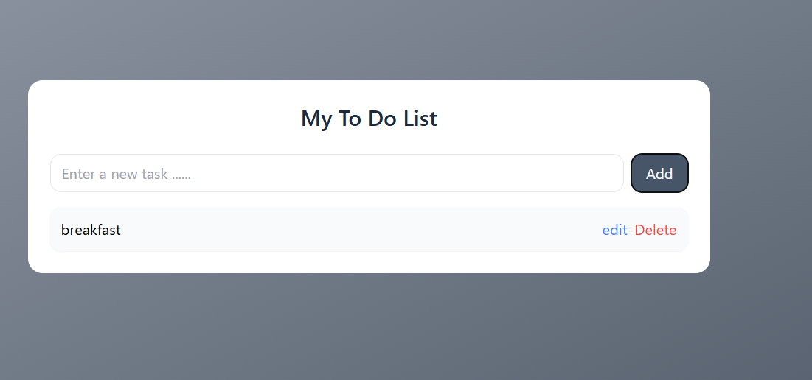

used hooks;
useEffect,useState

# ... =====>> this three dots is a spread operator
we use spread operator to combine previous data and new data.beacuse this is a to do list.The list can contain both old and new tasks.

# //conditional rendering//

multiple condition
{todos.length===0 ?(
no tsks yet
)
:
(
tasks found
)
}

# : ----> this called turnary operator

//mapping function//
